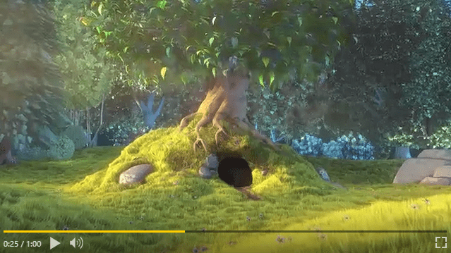
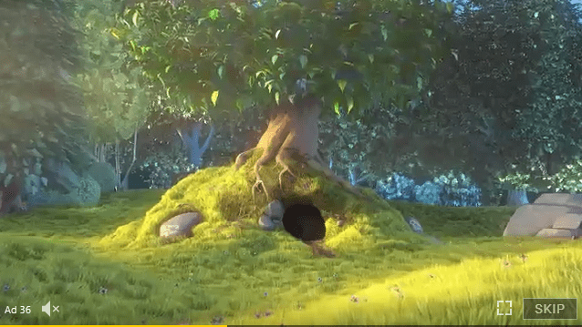

# GG EZ Video Player

Simple video player with minimal setup, intuitive API and straightforward features.



## Features:

- Easy setup
- Customizable controls (or use our slick defaults!)
- Lightweight
- Programmatic access to video playback APIs
- UMD, CommonJS and ES module versions
- VAST / VPAID / MOAT Support for a single Linear Creative. Parsing is provided by [dailymotion/vast-client-js](https://github.com/dailymotion/vast-client-js). *Note* that at the time, only one Ad is loaded, and only Linear Creatives are played and tracked.

## Installation

There is no package available, but in the meantime, we provide different builds in the `dist/` directory:

```
gg-ez-vp.umd.js // Browser
gg-ez-vp.cjs.js // CommonJs
gg-ez-vp.esm.js // ES Module

```

## Usage

First import or load the library:

```
// Browser
<script src="dist/gg-ez-vp.umd.js">

//CJS
const GgEzVp = require('gg-ez-vp')

// ES
import GgEzVp from 'gg-ez-vp'
```

GgEzVp works by attaching itself to a unique container, ideally an empty `<div>` with a unique id:

```
<body>
    <div>
        <div class="randomContent">
            Some content
        </div>
        <div id="myVideo" class="myVideoStyles"></div>
    </div>
</body>
```

Then, to create a player instance:
```
// js
const minimalConfiguration = {
    container: 'myVideo',
    src: 'myvideo.mp4'
};

const ggEzVpInstance = new GgEzVp(minimalConfiguration);
```

This minimal configuration will create a unique video player instance using the defaults set by GgEzVp.

**note**: `src` and `container` are the only required options in the configuration object.

## Customization

### Options:

|key|defaultValue|required|description|
|---|---|---|---|
|container|null|true| id of the DOM node where the player will be attached|
|src|null|true| string or array of strings used to retrieve video and/or VAST
| width  |null   |false| by default the player will take available space, unless width is specified |
| height  |null   |false| by default the player will take available space, unless height is specified |
| controls  |object   |false| specific controls configurations, see Controls section below |
| autoplay  |false   |false | whether to play the video automatically or not  |
| volume  |1   |false | initial volume for playback must be between 0.0 and 1  |
| muted  |true   |false | video will be muted by default  |
| playsinline  | true   |false | [A Boolean attribute indicating that the video is to be played within the element's playback area.](https://developer.mozilla.org/en-US/docs/Web/HTML/Element/video#attr-playsinline) |
| poster  |null   |false | source for an image to be used as video poster  |
| preload  |'auto'   |false | standard HTML values for preload (none|metadata|auto)  |
| loop  | false   |false | whether to loop video or not  |
| isVAST  | false   |false | enables support for a single VAST / VPAID / MOAT TAG to be parsed and used as source, will force displaying the ad controls  |
| isAd  | false   |false | forces displaying the ad controls instead of the regular contols  |

### Controls
Besides the programmatic interaction with the player, there are also a number of controls displayed by default, they can be toggled by passing a `controls` property in the initial configuration.
See the Styles section for information on how to customize the visuals.


|controlName|defaultValue|description|
|---|---|---|
|timestamp|true|display the current time of the video in the format [m:ss]|
|volume|true|display the volume controls (mute toggle and range input)|
|progress|true|display the playback progress bar, clicking on the bar will set the video currentTime to the selected percentage (except on Ads)|
|play|true|show the play/pause button|
|expand|true|show the expand to fullscreen button|
|timestampAd|false|**used only for Ads**, will display the remaining time in the format [Ad ss]|
|skip|false|**used only for Ads**, will display a skip button|


Additionally, passing the `isVAST: true` or `isAd: true` options, will display a different set of controls for Ads:



|controlName|defaultValue|description|
|---|---|---|
|timestampAd|true|display the remainingTime time of the ad in the format [Ad ss].|
|skip|true|display a skip button, pressing it will emit the 'skip' event|
|progress|true| the progress bar will display, but it won't show the scrub, nor it be possible to set the time with it|
|play|true|show the play/pause button|
|expand|true|show the expand to fullscreen button|

 **Note:** the `timestamp` control will be disabled when either `isVAST` or `isAd` are true and instead `timestampAd` will be displayed.

#### Examples
```
// Controls off
const controlsOffConfig = {
    container: 'myVideo',
    src: 'myvideo.mp4',
    controls: false
};

// timestamp and volume off
const customControls = {
    container: 'myVideo',
    src: 'myvideo.mp4',
    controls: {
        timestamp: false,
        volume: false
    }
};

// ad timestamp, skip and expand off
const customControls = {
    container: 'myVideo',
    src: 'myvideo.mp4',
    isAd: true, // using isVAST will also enable ad controls
    controls: {
        timestampAd: false,
        expand: false,
        skip: false
    }
};
```

### Styles

To use the default styles, just include the `styles.css` file before loading the player's javscript.

The default styles that can be overridden by any custom styles you may need:

```
.gg-ez-vp--play {
    background: url('/images/my-custom-play-btn.png');
    width: 40px;
    height: 40px;
}

.gg-ez-vp--progress-filled {
    background: red;
}
```

Use these selectors to override the styles:

|selector|component|
|---|---|
|.gg-ez-vp| player container|
|.gg-ez-vp--viewer| video element|
|.gg-ez-vp--controls| control bar|
|.gg-ez-vp--timestamp| current video time |
|.gg-ez-vp--timestamp-break| bar dividing currentime / duration |
|.gg-ez-vp--timestamp-ad| ad remaining time |
|.gg-ez-vp--volume| volume controls container |
|.gg-ez-vp--volume-control| volume slider container |
|.gg-ez-vp--volume-control-slider| volume slider |
|.gg-ez-vp--input-range|volume slider input styles|
|.gg-ez-vp--progress| progress container |
|.gg-ez-vp--progress-bar| progress track |
|.gg-ez-vp--progress-filled| progress bar fill |
|.gg-ez-vp--progress-filled:after| progress bar scrub |
|.gg-ez-vp--button-icon| play and volume buttons |
|.gg-ez-vp--button-icon.mute| muted state of the volume control |
|.gg-ez-vp--button-icon.low| low volume state of the volume control (under 33%) |
|.gg-ez-vp--button-icon.medium| medium volume state of the volume control (between 34% and 66%) |
|.gg-ez-vp--button-icon.high| high volume state of the volume control (above 66%) |
|.gg-ez-vp--button-icon.play| shown while video is not playing on the play control |
|.gg-ez-vp--button-icon.pause| shown while video is playing on the play control |
|.gg-ez-vp--button-icon.replay| shown after the video ends |
|.gg-ez-vp--button-icon.expand| expand button icon  |

There are also a few modifier selectors applied to the container `.gg-ez-vp`:

|selector|description|
|---|---|
|.gg-ez-vp--no-scrub| applied on `isVAST: true` or `isAd: true`. Prevents displaying the scrub and adjusts ad styles.|
|.gg-ez-vp--skip| applied when the skip button will be displayed|
|.gg-ez-vp--volume-only| adjusts the styles when only the volume button is displayed for better distribution|


## Public methods
|method name|parameters|description|
|---|---|---|
|destroy|none|removes all instance and video tag listeners, removes the player from the DOM leaving behind the original container|
|fullscreenToggle|none|toggles the fullscreen mode|
|getCurrentTime|none|returns the currentTime from the video tag, this data is also provided by the playback-progress event|
|muteUnmute|none|toggle video sound on/off|
|mute|none|disable video sound (sets volume to 0)|
|unmute|none|enable video sound (sets volume to last value)|
|on|`eventName, listenerFn`|attaches a listener function to either the video tag or the player instance, the function will be run every time the event is fired, [see events](#events)|
|once|`eventName, listenerFn`|attaches a listener function to either the video tag or the player instance, the function will fire just on time, [see events](#events)|
|pause|none|stop video playback|
|playPause|none|toggle pause state on/off|
|play|none|start video playback|
|volume|float number|sets the video volume, [see volume configuration](#customization)|
|getVolume|float number|gets the video volume|
|getDuration|number|gets the video duration|

## Accessible properties
All properties are read-only:

|property name|type|description|
|---|---|---|
|ready|boolean|helps identify when the video/ad is rendered and ready for playback|
|dataReady|boolean|helps identify when the player has all the data it needs to render the video and all listeners have been set|
|config|object|current player's configuration, see Options|
|player|DOM node|current video tag, it is not recommended to interact directly with it, and instead rely on the player's methods, but is provided if necessary|
|dimensions|object|current player dimensions|
|VPAIDWrapper|object|wrapper that allows direct interaction with a VPAID creative if available, it is not recommended to interact directly with it, but it is possible if necessary|

## Events

Listen for any `<video>` tag [events](https://developer.mozilla.org/en-US/docs/Web/HTML/Element/video#Events) or GgEzVp events:

```
ggEzVpInstance.on('play', myPlayListener);
ggEzVpInstance.on('playback-progress', myPlaybackListener);
```

Listen to them only once:

```
ggEzVpInstance.once('play', myPlayListener);
ggEzVpInstance.once('playback-progress', myProgressListener);
```


The player also emits custom events to extend the video tag behavior:

|event name|description|payload|
|---|---|---|
|data-ready| emitted when a source for the video is received, either by configuration or after asynchronous VAST parsing | `undefined` |
|playback-progress| emitted when the video currentTime changes | `{ remainingTime, readableTime, duration, currentTime, fancyCurrentTime, fancyDuration }` |
|player-click| emitted when clicks are detected inside the container element | click event |
|pre-destroy| emitted before removing listeners and the container node| `undefined` |
|ready| emitted when the class is ready for playback| `undefined` |
|resize| emitted when video tag changes either width or height | `{ width, height }` |
|skip| emitted when the skip button is pressed | `undefined` |
|expand| emitted when the fullscreen is toggled | boolean `isFullscreen` |
|error| emitted when player encounters an error | error message or object |

Custom events are provided by [Nano Events](https://github.com/ai/nanoevents)

## VAST
VAST 3.0 is supported, thanks to [dailymotion/vast-client-js](https://github.com/dailymotion/vast-client-js) for the playback of a **single Linear Creative**.
If a VPAID is detected, it will be loaded and executed, otherwise, the player will track and emit all the events in the VAST tag.

## VPAID
The player is capable of playing VPAID 2.0 if the `src` is a VAST tag and `isVAST` is set to `true` in the configuration.
Player events will not be set immediately, instead they will be stored and attached after the VPAID has emitted the `onAdLoaded` event.

### Event mapping
All VPAID events are emmitted, additionally, some of them will also fire a custom event:

|VPAID event name| GgEzVp event name|
|---|---|
|AdLoaded|data-ready|
|AdStarted|play|
|AdPlaying|play|
|AdVideoStart|play|
|AdPaused|pause|
|AdStopped|ended|
|AdRemainingTimeChange|playback-progress|
|AdError|error|

It is encouraged to use these events mapped by the player, but if you require listening to other events, [all VPAID events](https://www.iab.com/wp-content/uploads/2015/06/VPAID_2_0_Final_04-10-2012.pdf) are emitted as well with exception of the `AdRemainingTimeChange` event (use `playback-progress` instead).
All data is retrieved from the VPAID creative, not the video tag itself.

## Development

`yarn install` to install dependencies

`yarn start` to fire dev server and node watcher, the server can be accessed at localhost:8080

See scripts section of package.json for all available scripts
